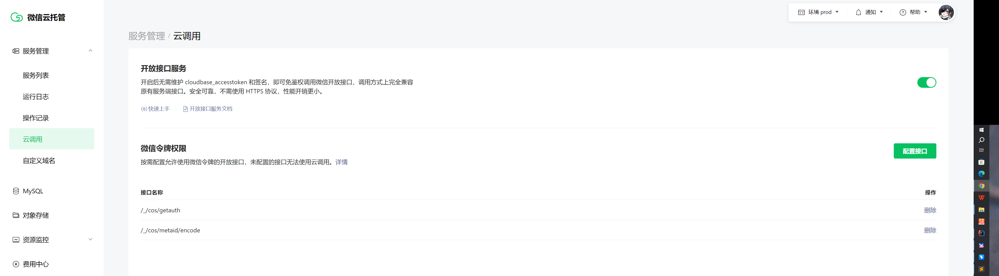

微信云托管对象存储用于存放数据或文件，一般用于较大数据或较大文件上传时的中转对象，避免直接上传到服务端，影响服务性能。
# 对象存储
开通了云托管平台后会自动开通对象存储功能。简单理解就是一个文件目录即可。


## 存储文件

* 文件名称：如果上传时未指定，会自动生成唯一标识
* File ID：小程序一般通过该信息访问，格式`cloud://{对象存储域名}.${对象存储桶信息}/${对象存储目录}/${文件名称}`
* 详情中还有文件的访问地址

## 存储权限
所有对象文件的权限统一管理，有以下几种类型：
* 所有用户可读，仅创建者可读写
* 仅创建者可读写
* 所有用户可读
* 所有用户不可读写
* 自定义安全规则


## 存储配置
显示存储桶信息，以及安全访问域名，缓存配置等等。


# 访问
访问方式分为：
* API方式：即通过http协议管理存储对象
* SDK方式：通过官方[COS-SDK](https://cloud.tencent.com/document/product/436/6474)管理存储对象，实际内部也是使用的api方式

## 小程序访问
[参考官方文档](https://developers.weixin.qq.com/miniprogram/dev/wxcloudrun/src/development/storage/miniapp/)
### 上传文件
采用`wx.cloud.uploadFile`云函数上传文件,可以自动根据小程序上传到指定云托管对象存储中。
字段|	说明|	数据类型|	默认值|	必填
:---|:---|:---|:---|:---
cloudPath|	云存储路径，命名限制见文件名命名限制|	String|	-|	是
filePath|	要上传文件资源的路径|	String|	-|	是
config|	配置|	Object|	-|	否
success|	成功回调			
fail|	失败回调			
complete|	结束回调

```js
export const uploadObjFile = (filePath,fileName)=>{
    if(fileName == undefined){
        fileName = filePath.slice(filePath.lastIndexOf("/") + 2 , filePath.length)
    }
    return new Promise((success,fail)=>{
        wx.cloud.uploadFile({
            // config:config,
            cloudPath:`${cloud_path}/${fileName}`, // 云托管对象存储中的文件路径
            filePath:filePath, // 本地文件
            success:success, // 成功回调
            fail:fail // 异常回调
        })
    })
}
```

### 下载文件
采用`wx.cloud.downloadFile`云函数下载文件.
字段|	说明|	数据类型|	默认值	|必填
:---|:---|:---|:---|:---
fileID|	云文件 ID|	String|	-|	是
config|	配置|	Object|	-|	否
success|	成功回调			
fail|	失败回调			
complete|	结束回调			

```js
export const downloadObjFile=(fileID)=>{
    return new Promise((success,fail)=>{
        wx.cloud.downloadFile({
            fileID: fileID,
            success:success,
            fail:fail
        })
    })
}
```
**注意**：服务端上传的文件需要添加文件元数据才能被小程序访问，否则访为空路径失败，目前我还未尝试成功，后面博客专门解决这个现象。

### 获取Url地址
采用`wx.cloud.getTempFileURL`云函数获取文件URL地址.应该是共享作用。
```js
export const tempObjFileUrl = (option)=>{
    return new Promise((success,fail)=>{
        wx.cloud.getTempFileURL({
            fileList:[
                {
                    fileID:option.fileID,
                }
            ],success:success,fail:fail
        })
    })
}
```

## 服务端访问(Java)
[参考官方文档](https://developers.weixin.qq.com/miniprogram/dev/wxcloudrun/src/development/storage/service/)  
[参考Java Cos SDK](https://cloud.tencent.com/document/product/436/10199)

SDK使用步骤：
1. 使用[开放接口服务](https://developers.weixin.qq.com/miniprogram/dev/wxcloudrun/src/guide/weixin/open.html)获取临时密钥。
2. 使用临时密钥初始化COS-SDK
3. 使用COS-SDK做增删改查等操作。
4. 上传文件时，需要使用开放接口服务获取文件元数据，保证小程序端可以访问。

注意事项：
* 云托管服务时只要配置了开放接口，就可以免accessToken访问微信的指定开放接口
* 临时密钥是由时效的，如果操作不频繁时，建议每次操作前都重新获取新的临时密钥
* 通过SDK上传的文件需要对文件配置元数据，否则小程序无法访问，这就是上面小程序下载文件时描述的问题原因。

依赖：
```xml
    <dependency>
        <groupId>com.qcloud</groupId>
        <artifactId>cos_api</artifactId>
        <version>5.6.24</version>
    </dependency>
```


### 配置开放接口
在云托管平台服务管理下的云调用配置中配置需要访问的微信开放接口，配置接口路径即可(以根路径开始)

实际效果，假如存在开放接口`http://api.weixin.qq.com/_/cos/getauth?accessToken=token`,原本需要携带accessToken信息，当配置了开放接口配置`/_/cos/getauth`，则服务端代码内部实际访问`http://api.weixin.qq.com/_/cos/getauth`即可，无需专门先获取accesToken再发起请求，这也是云托管/云开发的优势。

### 获取临时密钥
该请求需要服务端自己通过http请求获取，非通过SDK
```
http://api.weixin.qq.com/_/cos/getauth
```
返回内容(json格式):
```json
{
  "TmpSecretId": "",  // 临时密钥的 tmpSecretId
  "TmpSecretKey": "", // 临时密钥的 tmpSecretKey
  "Token": "", // 临时密钥的 sessionToken
  "ExpiredTime": ""  // 临时密钥失效时间戳，是申请临时密钥时，时间戳加 durationSeconds
}
```
### 生成CosClient
```java
    private String secretId = "TmpSecretId"; // 临时密钥中的TmpSecretId
    private String secretKey = "TmpSecretKey"; // 临时密钥中的TmpSecretKey
    private String token = "Token"; // 临时密钥中的Token
    private String region="region"; // 区域信息，见对象存储设置中的存储信息，如ap-shanghai
    private COSClient getClient(){
        try{
            ClientConfig clientConfig = new ClientConfig(new Region(region));
            COSCredentials cosCredentials = new BasicSessionCredentials(secretId, secretKey, token);
            //生成cos客户端
            return new COSClient(cosCredentials, clientConfig);
        }catch (Exception ex){
            LOGGER.error("get cos client is error!",ex);
        }
        return null;
    }
```

### 上传文件
通过`PutObjectRequest`请求和`client.putObject`实现上传文件或流数据。
```java
    private String prefix="";//文件存放路径
    private String bucketName="";// 对象存储桶信息，见对象存储设置信息
    public String upload(String fileName, InputStream is,String openId) {
        COSClient cosClient = getClient();
        if (cosClient==null) throw new RuntimeException("get cos client is error!");

        try {
            String key = config.getPrefix() + fileName;
            LOGGER.info("upload cos obj:{}",key );
            //创建存储对象的请求
            PutObjectRequest putObjectRequest = new PutObjectRequest(config.getBucketName(), key, is,new ObjectMetadata());
            //执行上传
            cosClient.putObject(putObjectRequest);
            LOGGER.info("upload success:{}",key);
            return key; // 返回了对象存储的完整路径
        } catch (CosClientException e) {
            LOGGER.error("upload fail!",e);
        } finally {
            cosClient.shutdown();
        }
        return null;
    }
```
注意：这里需要对文件元数据操作，否则小程序无法访问，见后续博客解决。

### 下载(获取)文件
通过`GetObjectRequest`请求和`client.getObject`实现获取文件或流数据。
```java
    // 这里我直接返回的是流数据
    public InputStream getObj(String fileName) {
        if (fileName==null) return null;

        COSClient cosClient = getClient();
        if (cosClient==null) throw new RuntimeException("get cos client is error!");

        try{
            String key = config.getPrefix() + fileName;
            LOGGER.info("get cos obj:{}",key );
            //创建存储对象的请求
            GetObjectRequest getObjectRequest = new GetObjectRequest(config.getBucketName(), key);
            return cosClient.getObject(getObjectRequest).getObjectContent();
        }catch (Exception ex){
            LOGGER.error("get cos object is error!",ex);
        }finally {
            cosClient.shutdown();
        }
        return null;
    }
```
