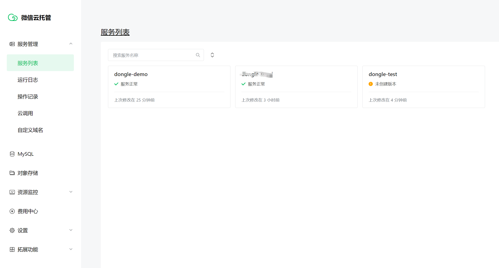
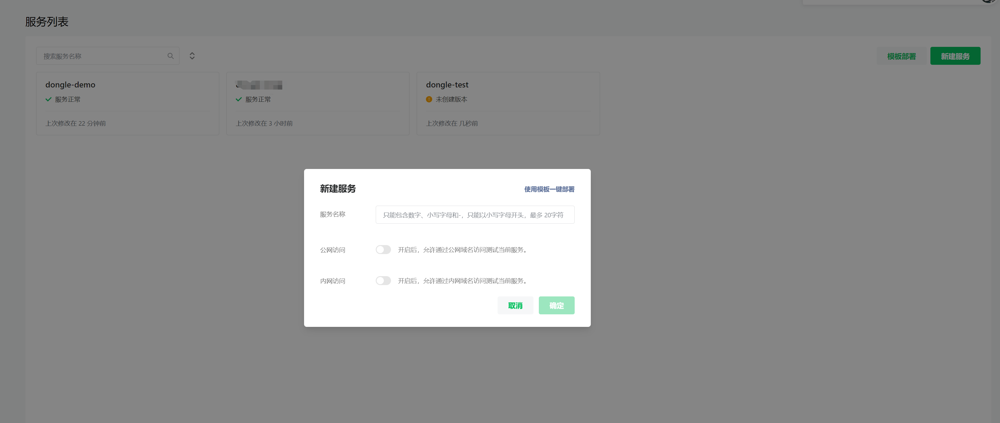
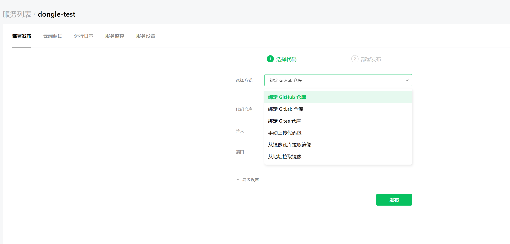
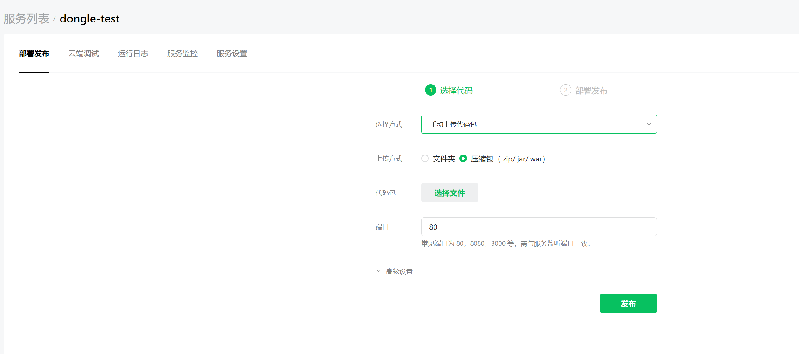
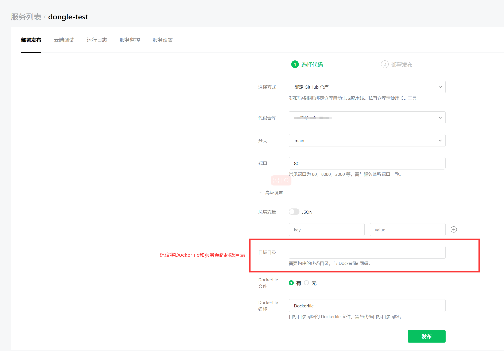
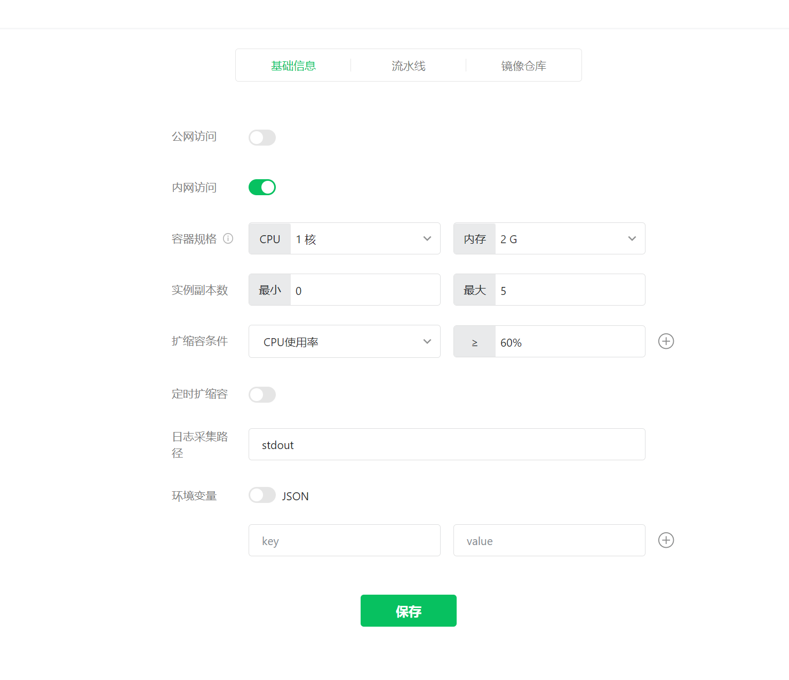

# 链接
[官方文档](https://developers.weixin.qq.com/miniprogram/dev/wxcloudrun/src/)  
[云托管官网](https://cloud.weixin.qq.com/cloudrun)

# 特点
* 无需自提供服务，有云托管平台自动分配，并自动缩容/扩容
* 支持多种语言及模板实例
* 采用容器化管理方式实现服务部署
* 支持小程序内网访问，仅公网测试，提供足够的安全防护，微信用户就近接入
* 微信天然鉴权，无需服务端二次获取用户信息，可直接在请求header中获取用户信息
* 提供服务多种部署方式以及多种资源监控
* 包含对象存储，数据库，容器存储，静态资源等等，统一收费。

# 平台
通过扫描登录控制台。分为服务管理，Mysql，对象存储，资源监控，设置，功能扩展，费用中心模块。


## 服务管理
### 新建服务
点击创建服务，根据指示输入服务名称，选择是否开启公网/内网。公网只能做调试使用，不能用于线上。如果有内网服务访问，建议开启内网。

服务部署有多种方式，一种是自定义Dockerfile容器配置部署，一种是通过上传代码文件由云平台环境部署，再一种就是直接拉取已经生成的服务镜像。都是采用容器化部署方式，建议对容器化部署或Docker有一定的了解，或者干脆上传代码让云平台部署。

包部署方式，直接上传部署文件：


#### 代码仓库部署
以自定义容器配置部署方式为例，采用从代码仓库拉取代码，并且需要在对应目录创建Dockerfile(建议保留，如果不同需要在高级设置中修改)。

Dockerfile示例：[参考官方springboot部署示例](https://github.com/WeixinCloud/wxcloudrun-springboot)
```
# 二开推荐阅读[如何提高项目构建效率](https://developers.weixin.qq.com/miniprogram/dev/wxcloudrun/src/scene/build/speed.html)
# 选择构建用基础镜像。如需更换，请到[dockerhub官方仓库](https://hub.docker.com/_/java?tab=tags)自行选择后替换。
FROM maven:3.6.0-jdk-8-slim as build

# 指定构建过程中的工作目录
WORKDIR /app

# 将src目录下所有文件，拷贝到工作目录中src目录下（.gitignore/.dockerignore中文件除外）
COPY src /app/src

# 将pom.xml文件，拷贝到工作目录下
COPY settings.xml pom.xml /app/

# 执行代码编译命令
# 自定义settings.xml, 选用国内镜像源以提高下载速度
RUN mvn -s /app/settings.xml -f /app/pom.xml clean package

# 选择运行时基础镜像
FROM alpine:3.13

# 安装依赖包，如需其他依赖包，请到alpine依赖包管理(https://pkgs.alpinelinux.org/packages?name=php8*imagick*&branch=v3.13)查找。
# 选用国内镜像源以提高下载速度
RUN sed -i 's/dl-cdn.alpinelinux.org/mirrors.tencent.com/g' /etc/apk/repositories \
    && apk add --update --no-cache openjdk8-jre-base \
    && rm -f /var/cache/apk/*

# 容器默认时区为UTC，如需使用上海时间请启用以下时区设置命令
# RUN apk add tzdata && cp /usr/share/zoneinfo/Asia/Shanghai /etc/localtime && echo Asia/Shanghai > /etc/timezone

# 使用 HTTPS 协议访问容器云调用证书安装
RUN apk add ca-certificates

# 指定运行时的工作目录
WORKDIR /app

# 将构建产物jar包拷贝到运行时目录中
COPY --from=build /app/target/*.jar .

# 暴露端口
# 此处端口必须与「服务设置」-「流水线」以及「手动上传代码包」部署时填写的端口一致，否则会部署失败。
EXPOSE 80

# 执行启动命令.
# 写多行独立的CMD命令是错误写法！只有最后一行CMD命令会被执行，之前的都会被忽略，导致业务报错。
# 请参考[Docker官方文档之CMD命令](https://docs.docker.com/engine/reference/builder/#cmd)
CMD ["java", "-jar", "/app/springboot-wxcloudrun-1.0.jar"]

```
### 服务设置
可以在服务设置中修改服务相关设置。

* 可以控制公内网开关：公网仅调试连接
* 当实例副本最小为0时，若没有服务请求，则会自动中断实例，在有新的请求时才会重新启动实例

#### 关闭服务
当需要删除服务时，选择关闭服务即可

