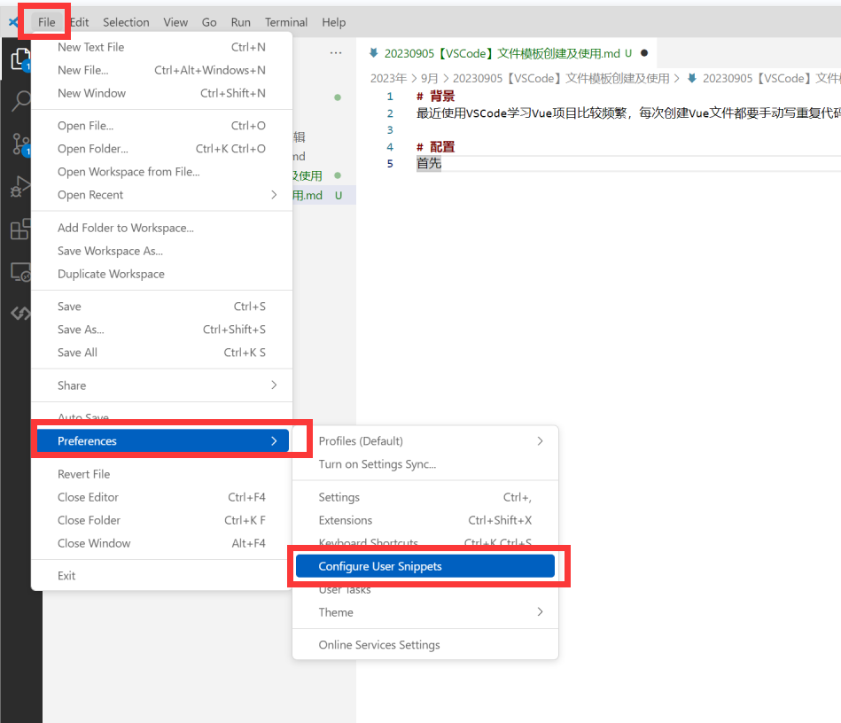
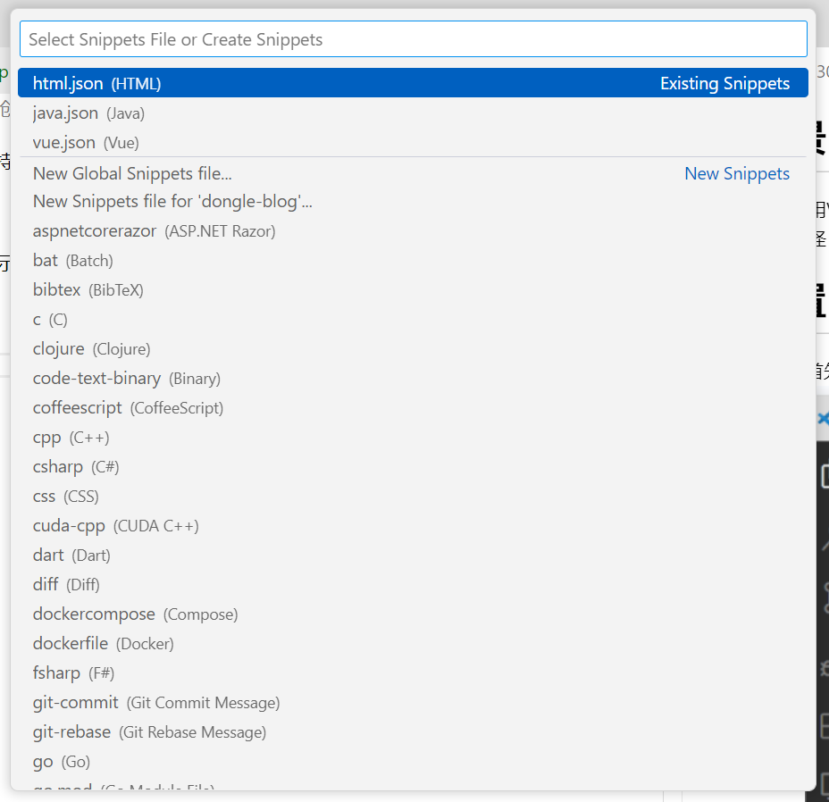

# 背景
最近使用VSCode学习Vue项目比较频繁，每次创建Vue文件都要手动写重复代码，特别麻烦，就上网查找自动生成代码的说明，结果发现VSCode有代码模板，怪怪，感觉发现新大陆了(low!)。

# 配置
1. 首先打开File->Preferences->Configure User Snippets配置，如下图所示：

   1. 或通过快捷键`Ctrl+Shift+P`打开命令面板，输入`snippets`，选择`Configure User Snippets`
    

2. 然后选择需要配置模板的对应文件类型（以vue模板为例，选择vue.json，其他模板同理为类型.json），如：



3. 配置自定义代码模板:
   * `"Print to console"` 代码模板内容
   * `"prefix"` 代码模板前缀，在对应类型中使用该前缀可触发根据代码模板生成代码
   * `"body"` 代码模板数据，实际是字符串数组
   * `$1,$2,$3` 代码模板变量，根据变量顺序从1开始，$0为最后一个变量，会在代码生成后输入，根据次序代表变量顺序
   * `${1:default}` 代码模板变量默认值，当不输入时以默认值显示，否则显示输入值
```json
{
    {
	// Place your snippets for vue here. Each snippet is defined under a snippet name and has a prefix, body and 
	// description. The prefix is what is used to trigger the snippet and the body will be expanded and inserted. Possible variables are:
	// $1, $2 for tab stops, $0 for the final cursor position, and ${1:label}, ${2:another} for placeholders. Placeholders with the 
	// same ids are connected.
	// Example:
	// "Print to console": {
	// 	"prefix": "log",
	// 	"body": [
	// 		"console.log('$1');",
	// 		"$2"
	// 	],
	// 	"description": "Log output to console"
	// }
    "Print to console":{
		"prefix": "vue",
		"body": [
			"<template>",
			"	<div class='${1:home}'></div>",
			"</template>",
			"<script>",
			"export default {",
			"	name: '${2:Home}',",
			"	data() {",
			"		return {",
			"		}",
			"	},",
			"	methods: {},",
			"};",
			"</script>",
		]
	}
}
```

# 使用
4. 配置完成后，在VSCode中输入模板名称，按tab键即可生成模板代码，如下图所示：

