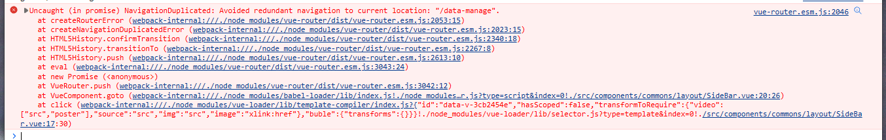

# 问题集
整理了部分Vue Router路由无法跳转问题：
1. 顶层`router-view`只能被顶层路由配置内容使用：此问题异常表现在路由跳转但页面不变
2. 子路由跳转必需父路由对应的组件中存在`router-view`：此问题异常表现在路由跳转但页面不变
   1. 子路由配置路径会自动继承父路径并自动增加`/`
   2. 如果子路径配置路径存在前缀`/`，则代表为全路径，需要包含父路由路径
3. 跳转路由与当前路由相同时，会触发`NavigationDuplicated`错误

# 顶层路由视图只能顶层配置使用
```html
<!-- App.vue -->
<template>
  <div id="app">
    <router-view/> <!--顶层路由视图-->
  </div>
</template>
```
## 父组件
子层路由视图，只能子路由配置可以使用，比如`/parent`路由中的**children子路由**配置`child`。  
换句话说：子路由可以跳转则必需对应父路由的组件中村啊在`<router-view/>`
```html
<!-- Parent.vue -->
<template>
  <div id="parent">
    Parent Content
    <router-view/> <!--关键点：子层路由视图-->
  </div>
</template>
```
## 子组件
```html
<!-- Child.vue -->
<template>
  <div id="child">
      Child Content
  </div>
</template>
```
## 路由配置
1. 一级路由只能用在在顶层路由视图，如`name=Home,Parent`等路由只能用在`App.vue`中的`<router-view/>`
2. 子路由只能用在父组件中的`<router-view/>`中，如`name=Child`路由只能用在`Parent.vue`中的`<router-view/>`
3. 如果Child组件中仍有`<router-view/>`，并且需要使用,
   1. 则可以在`name=Child`路由中继续配置`children`子路由
   2. 或者配置新的和'name=Parent'同级别的路由配置依赖`Child.vue`组件，如`name=NewChild`,并在其中配置`children`子路由
```js
// router配置
export default new Router({
  routes: [
    {
      path: '/',
      name: 'Home',
      redirect:'/parent', // 可以使用App.vue中的顶层路由视图
    },
    {
      path: '/parent',
      name: 'Parent',
      component: Parent,
      children: [
        {
          path: 'child', // 非全路径配置时，子路径开头无需`/`,只需子路径`child`
          // path : '/parent/child', // 也可以配置全路径
          name: 'Child',
          component: Child,
        //   children: [] // 如果Child组件中仍有<router-view/>，则可以继续配置子路由
        },
      ],
    },
    {
      path: '/new-child',
      name: 'NewChild',
      component: Child,
    //   children: [] // 如果Child组件中仍有<router-view/>，则可以继续配置子路由
    },
  ],
})
```
# 子路由路径问题
1. 子路由路径以`/`开头代表全路径配置，需要包含父路由路径,如`path:'/parent/child'`
2. 子路由可省略`/`开头，自动继承父路由路径，如`path:'child'`
上面也有代码说明也有介绍
```js
// router配置
export default new Router({
  routes: [
    {
      path: '/parent',
      name: 'Parent',
      component: Parent,
      children: [
        {
          path: 'child', // 非全路径配置时，子路径开头无需`/`,只需子路径`child`
          // path : '/parent/child', // 也可以配置全路径
          name: 'Child',
          component: Child,
        },
      ],
    },
  ],
})
```
# 路由重复问题
    vue-router 不知道哪个版本开始的问题，小编没关心过这个，解决内容可以参考.

当准备跳转的路由是当前路由是，即假如当前路由时`/parent`,仍旧执行`this.$router.push('/parent')`就会报类似以下错误：


```console
NavigationDuplicated: Avoided redundant navigation to current location: "/data-manage".
    at createRouterError (webpack-internal:///./node_modules/vue-router/dist/vue-router.esm.js:2053:15)
    at createNavigationDuplicatedError (webpack-internal:///./node_modules/vue-router/dist/vue-router.esm.js:2023:15)
    at HTML5History.confirmTransition (webpack-internal:///./node_modules/vue-router/dist/vue-router.esm.js:2340:18)
    at HTML5History.transitionTo (webpack-internal:///./node_modules/vue-router/dist/vue-router.esm.js:2267:8)
    at HTML5History.push (webpack-internal:///./node_modules/vue-router/dist/vue-router.esm.js:2613:10)
    at eval (webpack-internal:///./node_modules/vue-router/dist/vue-router.esm.js:3043:24)
    at new Promise (<anonymous>)
    at VueRouter.push (webpack-internal:///./node_modules/vue-router/dist/vue-router.esm.js:3042:12)
    at VueComponent.goto (webpack-internal:///./node_modules/babel-loader/lib/index.js!./node_modules/vue-loader/lib/selector.js?type=script&index=0!./src/components/commons/layout/SideBar.vue:24:26)
    at click (webpack-internal:///./node_modules/vue-loader/lib/template-compiler/index.js?{"id":"data-v-3cb2454e","hasScoped":false,"transformToRequire":{"video":["src","poster"],"source":"src","img":"src","image":"xlink:href"},"buble":{"transforms":{}}}!./node_modules/vue-loader/lib/selector.js?type=template&index=0!./src/components/commons/layout/SideBar.vue:17:30)
```

解决方法：
1. 重写`vue-router`的`push`方法
2. 捕获异常并忽略：当然也需要自己定义一个统一的push方法用来替换使用`this.$router.push`
3. 自记录当前路径和要跳转的路径，如果当前路径和要跳转的路径相同，则不跳转

## 重写push方法
在`router/index.js`(在自己项目的路由配置中哈，不要非要较真~)重写`VueRouter.push`方法
```js
import VueRouter from 'vue-router'
const VueRouterPush = VueRouter.prototype.push
VueRouter.prototype.push = function push(to) {
    return VueRouterPush.call(this, to).catch(err => err)
}
```
## 捕获异常并忽略
```js
this.$router.push(url).catch(() => {})
```
推荐提取为统一公共方法，如：
```js
export const routerPush = (url) => {this.$router.push(url).catch(() => {})}
```
## 判断路径是否为当前路径
如果路径非当前路径才允许跳转，否则不跳转，同样推荐提取为统一公共方法
```js
// currentUrl存储在内存中
if (this.$route.path !== currentUrl) {
    this.$router.push({ path: currentUrl })
  }
```