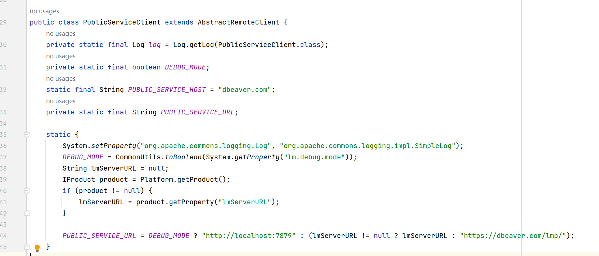

    DBeaver是一个免费的跨平台数据库工具，适用于开发人员、数据库管理员、分析师和所有使用数据的人。它支持所有流行的SQL数据库,如MySQL, MariaDB, PostgreSQL, SQLite等等

[DBeaver社区官网](https://dbeaver.io/) [DBeaver专业版官网](https://dbeaver.com/) [DBeaver Github](https://github.com/dbeaver/dbeaver)

主要版本：
* 社区版：提供基础的关系型数据库支持，不支持nosql数据库
* 付费版
  * Lite版：开发工具受限
  * Enterprise版：不支持云
  * Ultimate版：云支持，没有月付选项
  * Team版：多人团队版
  * CloudBeaver:支持可视化查询

# 安装
从官网下载指定产品进行安装即可，此处无需多言~

# 付费版破解
1. 跳过网络校验方式：
  a. 设置hosts127.0.0.1 dbeaver.com 屏蔽网址
  b. 配置文件dbeaver.init中设置-Dlm.debug.mode=true 
具体原因：可查看以下内容

2. 创建一个java空项目，导入以下包：(从dbeaver安装目录下的plugins目录查找{DBeaverHome}/plugins/)
  a. com.dbeaver.lm.core_{version}.jar
  b. org.jkiss.lm_{versiion}.jar
  c. org.jkiss.utils_{versiion}.jar
  d. 执行以下java程序：注意根据安装的产品修改产品信息
    i. 当代码执行importLicense逻辑时，会在用户目录生成 `{USER HOME}/.jkiss-lm/{product-id}.lic`文件,打开DBeaver客户端就不会再要求输入License认证了。
```java

import com.dbeaver.lm.embedded.LicenseServiceEmbedded;
import org.jkiss.lm.*;
import org.jkiss.utils.Base64;

import java.io.*;
import java.net.URL;
import java.nio.charset.StandardCharsets;
import java.security.Key;
import java.security.KeyPair;
import java.security.PrivateKey;
import java.security.PublicKey;
import java.util.Date;

/**
 * @author Dongle
 * @desc
 *   1. 导入依赖包：
 * @since 2023/9/19 019 13:04
 */
public class Main {

    private static final LMProduct ENTERPRISE = new LMProduct(
            "dbeaver-ee",
            "DB",
            "DBeaver Enterprise",
            "DBeaver Enterprise Edition",
            "23.2",
            LMProductType.DESKTOP,
            new Date(),
            new String[0]
    );
    private static final LMProduct MAIN_PRODUCT = ENTERPRISE;

    public static void main(String[] args) throws Exception {
        // 生成新的公私钥密码对
        KeyObject key = generatorKey();
        // 替换对应应用包下的keys/{product.id}-public.key内容，
        // 如Enterprise产品，对应com.dbeaver.app.enterprise_{version}.jar
        System.out.println("--- PUBLIC KEY ---");
        System.out.println(toString(key.publicKey.getEncoded()));
        System.out.println();
        System.out.println("--- PRIVATE KEY ---");
        System.out.println(toString(key.privateKey.getEncoded()));
        System.out.println();
        
        // 生成许可证license
        encryptLicense(key);
        System.out.println("--- LICENSE,在认证处填写 ---");
        System.out.println(key.license);
        System.out.println();

        // TODO 提示，以下内容无需执行，当然可用于校验
        // 测试 importLicense
        LMLicense license = importLicense(key);
        if (importLicense(key) == null){
            System.out.println("测试失败，为无效License");
            return;
        }

        // 生成明文license
        System.out.println("--- LICENSE明文 ---");
        generateLicense(license,key);
    }
    private static KeyObject generatorKey() throws LMException {
        KeyPair keyPair = LMEncryption.generateKeyPair(2048);
        PublicKey publicKey = keyPair.getPublic();
        PrivateKey privateKey = keyPair.getPrivate();
        return new KeyObject(publicKey,privateKey);
    }

    private static void encryptLicense(KeyObject key) throws Exception {
        String licenseID = LMUtils.generateLicenseId(MAIN_PRODUCT);
        // 以下内容均可以通过in.readLine()输入替代
        String productID = MAIN_PRODUCT.getId();
        String productVersion = MAIN_PRODUCT.getVersion();
        String ownerID = "10000";
        String ownerCompany = "Test";
        String ownerName = "Dongle";
        String ownerEmail = "dongle@test.com";
        LMLicense license = new LMLicense(
                licenseID,
                LMLicenseType.ULTIMATE,
                new Date(),
                new Date(),
                null,
                LMLicense.FLAG_UNLIMITED_SERVERS,
                productID,
                productVersion,
                ownerID,
                ownerCompany,
                ownerName,
                ownerEmail);
        byte[] licenseEncrypted = LMEncryption.encrypt(license.getData(), key.privateKey);
        key.license = toString(licenseEncrypted);
    }

    private static LMLicense importLicense(KeyObject key) throws Exception {
        InputStream is = new ByteArrayInputStream(key.license.getBytes(StandardCharsets.UTF_8));
        byte[] encryptedLicense = LMUtils.readEncryptedString(is);
        LMLicenseManager lm = new LMLicenseManager(new LMEnvironment(),new LMKeyProvider() {
            public Key getEncryptionKey(LMProduct product) {
                return key.privateKey;
            }

            public Key getDecryptionKey(LMProduct product) {
                return key.publicKey;
            }
        }, null);
        return lm.importLicense(MAIN_PRODUCT, encryptedLicense);
    }

    private static void generateLicense(LMLicense license,KeyObject key) throws LMException {
        String licenseID = LMUtils.generateLicenseId(MAIN_PRODUCT);
        byte[] subData = license.getData();
        byte[] encrypted = LMEncryption.encrypt(subData, key.privateKey);
        String encodedBase64 = toString(encrypted);
        byte[] encodedBinary = Base64.decode(encodedBase64);
        LMLicense licenseCopy = new LMLicense(encodedBinary, key.publicKey);
        System.out.println(licenseCopy);
        System.out.println("Gen subscription");
        LMSubscription subscription = new LMSubscription(
                licenseID,
                LMSubscriptionPeriod.MONTH,
                new Date(),
                new Date(),
                1,
                true);
        subData = LMEncryption.encrypt(subscription.getData(), key.privateKey);
        String subBase64 = Base64.splitLines(Base64.encode(subData), 76);
        byte[] subBinary = Base64.decode(subBase64);
        LMSubscription subCopy = new LMSubscription(subBinary, key.publicKey);
        System.out.println(subCopy);
    }


    private static String toString(byte[] data){
        return Base64.splitLines(Base64.encode(data),76);
    }

    private static class KeyObject{
        private PublicKey publicKey;
        private PrivateKey privateKey;
        private String license;
        public KeyObject(){}

        public KeyObject(PublicKey publicKey, PrivateKey privateKey) {
            this.publicKey = publicKey;
            this.privateKey = privateKey;
        }
}
```
输出内容为以下结果：
```txt
--- PUBLIC KEY ---
MIIBIjANBgkqhkiG9w0BAQEFAAOCAQ8AMIIBCgKCAQEAjVXmee7i0r17vB5Nkiuxb8XImJwihGuw
oSA/jL4gJqhk4CwpPDiu5n5lK6ziws9w6vOsvANJ3Qr0YBhLfqFUkvNt4UxgbndMHqu0QsWQ/u1d
E2cl2P/26V5NeaETf4hSDvriXXL4KSq3YxsWUnsg9SubDVYmiqbuhUptj6BNtlOdP6dXkA6OytwO
9EYoiHPOQ7CHCZuYwSii+QAyQj0r5MIUKjlLSIVRmiB06A8c4q4oio8QcINK3spC7IM+lJZFS5rK
gGnz5+a66ona+j4GXrd4itOl7xaTeqS+KxU+IXooKAnhcfDZZfT7bSxgWAOEhHXADvXReIDrVPWS
sBQQcQIDAQAB

--- PRIVATE KEY ---
MIIEvgIBADANBgkqhkiG9w0BAQEFAASCBKgwggSkAgEAAoIBAQCNVeZ57uLSvXu8Hk2SK7FvxciY
nCKEa7ChID+MviAmqGTgLCk8OK7mfmUrrOLCz3Dq86y8A0ndCvRgGEt+oVSS823hTGBud0weq7RC
xZD+7V0TZyXY//bpXk15oRN/iFIO+uJdcvgpKrdjGxZSeyD1K5sNViaKpu6FSm2PoE22U50/p1eQ
Do7K3A70RiiIc85DsIcJm5jBKKL5ADJCPSvkwhQqOUtIhVGaIHToDxziriiKjxBwg0reykLsgz6U
lkVLmsqAafPn5rrqidr6PgZet3iK06XvFpN6pL4rFT4heigoCeFx8Nll9PttLGBYA4SEdcAO9dF4
gOtU9ZKwFBBxAgMBAAECggEAbvxtqIK3C9ZQPEFvmMFG7Qbbpzu0v1fxtBWm0dbbWIAT9xW2q9u3
PLk0qT9yMpjDiz0e/+V1M2dOz8dEQYRe7abLOojHkPeNhug+/dA3NHkhBgOR7P3T3x52qHSc4yEh
jzHkYI3P4kPxDppOxSZ7kwtTDv3/9hFwbKstrgOsAugpuAstHSMdehM78gRcNYWM5ftokRC6t/bS
PbwExBCpX8XpbAV4XWX06Tn6Z7IfyAY2E5ZbF4OXMVH2PyapM8sPlIpDC8n+m7EPkqSkwjpbG6sv
oi93MYnL2+BZYQB+jEuZny3L6NB7Prkz+UHdXykJbwhgNJT21eCcJnDMhQjbgQKBgQDTq8hcX07k
4PE0Hi5sRWA+paf3ZcHXA0cyMwicUTYYBjQOz96Crdr0E05E5CMP6CRYF88f6uz83kDvWQTBINY2
m89aNB5DfYPalAZg7Xkilql3xl9pTkD7ddfV9SdJEa6TaIU3WPhwhrPL1MFmkJZeiV036IDpbiE9
xeBKfT64tQKBgQCq70FePPbs+2I/xQTr2OUl8czL6Cv+bOP59pC0JTYguI3lRMqVz8zGv4i/gc9w
2lq05rrF1SS8m3OuJMKyU8YW4uv+LRx7Bb8vHP02SPF5JCX7m24aAHTTZ3h55IoxpTbMcnBGLf/9
gniG7siKRNPlRi38Ks7x7293ZyTySte6TQKBgQCuSuj0htYjyMVUMPXw2T9i1mz0Xam7LkvVnggd
DxIHvjPnbmq+GAIOsEbmmyPz2Sb0EsbOdVcm8KtvalFr5Wn+FVYr5HZ3BEcqGHEYJvJz9LMemQ2/
XFxNsr9CwlbS5+hkINBwvqXzojcyQ8HsfmoS9fD4NE7R54kfoGwLag3XcQKBgCaXVZ69DNJ7/rZ+
+Jl2omVqrd3rUONkGiQ48np5XDsO75ovab1g6M6GN41k9Tx5T7k/zjMT5/Nc9UT/r6UrHLHWEYmV
DbUImx074j77QOkkrB6d/MGKENYZqi1612hV8IU/4PE3OXA2oJd2GXh+CYjdy0v/LjGY6QWAF+tL
0mCRAoGBAIO0xSDQDkhuJN6KGoq/QcHQawNwl+Yb1sGSXK8UHB11T9um4M9+eiB2zL2atGR1D4Ie
ur7WgHCOqZ425HNm6IUg7fBPFrEEiI0yyGf4bws/tbKLsVBsz8DiPKbv8fLXqXvUT4mvmbZjph7Y
FWbIk8bj/uk+FTKjlI0bOubDvMyS

--- LICENSE,在认证处填写 ---
LZHPG/9UZKpRQ4j4uS67+KFxA3Iy2ACyr5pG3oyXK1Tn3EkcEjTG2SqDQHV5KtNhBCkYa+dbAD4L
L3Dja+H2gBbIfXHbIpYkJajiAQKWrqVKIixRJKNnJt5IcMG0FSaR2qchQ2npP5a51P0bkEXGB+Pg
n18qg3s8x5RK+z3G3v1X7nfGhapdlD6OEQfUKrsdXOYYCr6mqsAwoPLsDTVgyoZe8C2igkFbsDu5
umLmljkN8tvepw1qqo+sZdl57gRJxR1Y2fNlW/JxHNmOePxsgvQnuIKCW6U+e4A+Em/irr+W5uPq
ww+SZz9t4e1947M7qrcZmTZTsrmRlF7u6PyEIg==

--- LICENSE明文 ---
licenseId=DB-7H1MSZG7-ZKYL
licenseType=ULTIMATE
licenseIssueTime=Tue Sep 19 17:27:34 CST 2023
licenseStartTime=Tue Sep 19 17:27:34 CST 2023
licenseEndTime=null
flags=1024
productId=dbeaver-ee
productVersion=23.2
ownerId=10000
ownerCompany=TGB
ownerName=Dongle
ownerEmail=dongle@tgb.com
yearsNumber=1
usersNumber=1
Gen subscription
org.jkiss.lm.LMSubscription@5af97850
```
3. 将上面的PUBLIC KEY内容替换掉 {DBeaverHome}/plugins/com.dbeaver.app.{product}_{version}.jar/keys/{product-id}-public.key公钥内容
  a. 例如，
    i. 产品是DBeaver Enterprise,则在安装目录下的plugins目录中找到com.dbeaver.app.enterprise_{version}.jar 
    ii. 产品时DBeaver Ultimate，则对应的是com.dbeaver.app.ultimate_{version}.jar
  b. 提示：公钥文件会根据产品不同也有不同,即product-id的不同
4. DBeaver 认证
将结果输出的License信息导入


# 后话
• 如果实在懒得看代码，可以安装和我一样的产品(DBeaver Enter 23.2)，然后使用提供的公钥和认证信息进行配置，提前做好网络屏蔽(第一步)
```txt
--- PUBLIC KEY ---
MIIBIjANBgkqhkiG9w0BAQEFAAOCAQ8AMIIBCgKCAQEAjVXmee7i0r17vB5Nkiuxb8XImJwihGuw
oSA/jL4gJqhk4CwpPDiu5n5lK6ziws9w6vOsvANJ3Qr0YBhLfqFUkvNt4UxgbndMHqu0QsWQ/u1d
E2cl2P/26V5NeaETf4hSDvriXXL4KSq3YxsWUnsg9SubDVYmiqbuhUptj6BNtlOdP6dXkA6OytwO
9EYoiHPOQ7CHCZuYwSii+QAyQj0r5MIUKjlLSIVRmiB06A8c4q4oio8QcINK3spC7IM+lJZFS5rK
gGnz5+a66ona+j4GXrd4itOl7xaTeqS+KxU+IXooKAnhcfDZZfT7bSxgWAOEhHXADvXReIDrVPWS
sBQQcQIDAQAB

LZHPG/9UZKpRQ4j4uS67+KFxA3Iy2ACyr5pG3oyXK1Tn3EkcEjTG2SqDQHV5KtNhBCkYa+dbAD4L
L3Dja+H2gBbIfXHbIpYkJajiAQKWrqVKIixRJKNnJt5IcMG0FSaR2qchQ2npP5a51P0bkEXGB+Pg
n18qg3s8x5RK+z3G3v1X7nfGhapdlD6OEQfUKrsdXOYYCr6mqsAwoPLsDTVgyoZe8C2igkFbsDu5
umLmljkN8tvepw1qqo+sZdl57gRJxR1Y2fNlW/JxHNmOePxsgvQnuIKCW6U+e4A+Em/irr+W5uPq
ww+SZz9t4e1947M7qrcZmTZTsrmRlF7u6PyEIg==
```
• 以上内容仅供学习参考，请勿直接公司使用或用于其他商业活动，
• 个人如果不考虑连接nosql，可以直接使用社区版，基本功能也是够了，连接nosql也有其他工具替代方案，
• 公司使用建议官方购买，还有技术支持~
• 感谢：https://www.52pojie.cn/thread-1668629-1-1.html 文章分享，可以多去参考参考分析思路，对以后开发付费产品也是有帮助的。
