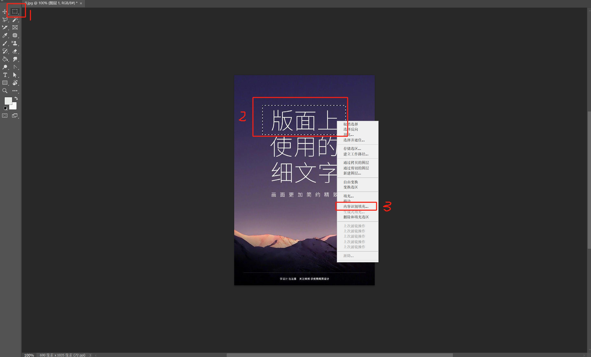
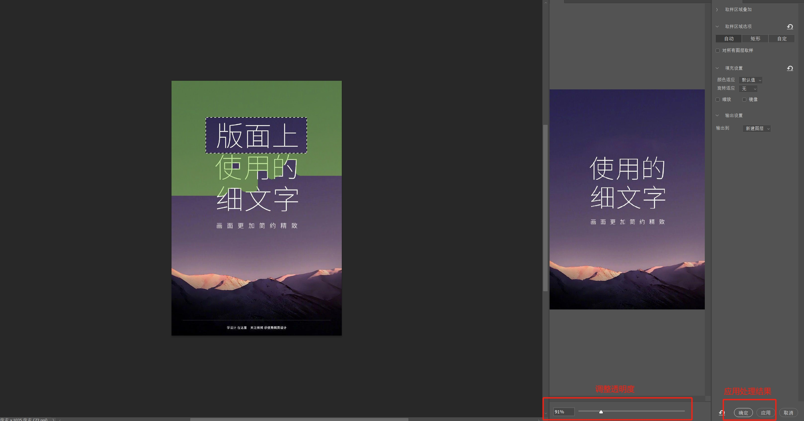
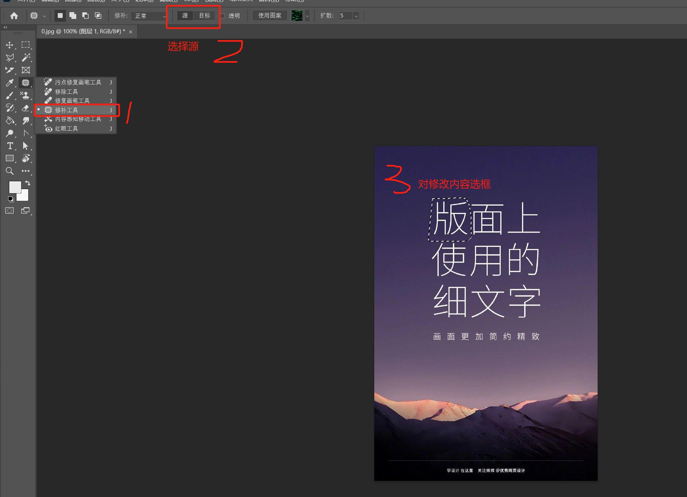
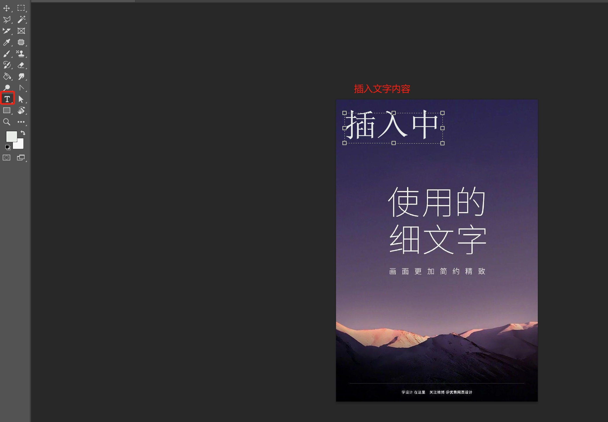
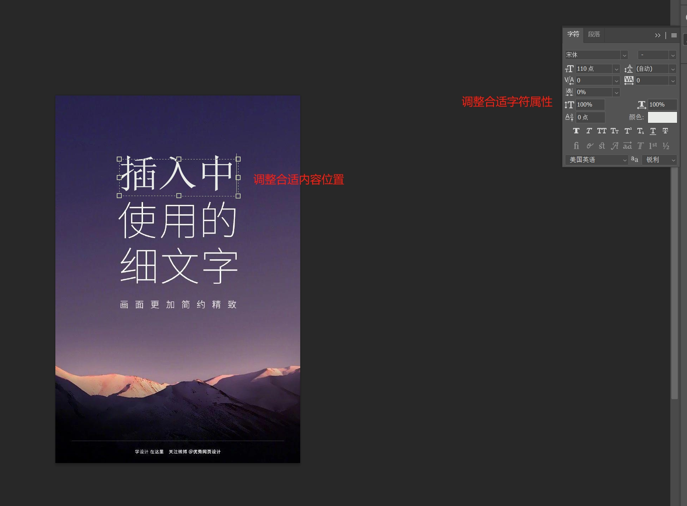

    Photoshop(PS)修改图片上文字内容，网上教材不少，本人整理实践过的方法，分享给各位。

本人实践方法：
* 内容识别填充：适用于背景色复杂的图片
* 内容修补工具：适用于背景色为纯色的图片

# 方式一：内容识别填充
1. 使用ps打开要修改的图片。(习惯性复制图层哦)
2. 使用选框工具选择要修改的区域，并进行内容识别填充

3. [插入文本](#插入文本)
4. 合并图层，然后保存新图片即可

# 方式二：修补工具
1. 使用ps打开要修改的图片。(习惯性复制图层哦)
2. 使用修补工具，修改顶部菜单修补内容为“源”(默认目标，相当于复制内容)

3. 选择修补区域，并将其拖动之没有文字的区域即可

4. [插入文本](#插入文本)
5. 合并图层，然后保存新图片即可

# 扩展
## 插入文本
1. 插入文字，并修改文字内容

2. 调整文本框位置和文字属性，如字体、字号、颜色等

**注意**：对文字修改，需要了解各种类字体的样式，如斜体、粗体、下划线等，**由于本人不专业，所以就不多说了**，只能操作以下简单常用的文本修改。

## 使用小技巧
* `Ctrl+j` 生成新图层
* `Ctrl+t` 选中图层
* 推荐原图新建图层，并将原图设置不可见，方便保护原图。

# 引用
1. 本文引用图片的原图：[https://tse2-mm.cn.bing.net/th/id/OIP-C.CqqgpmzS979w0JR5XE0TCgHaLH?w=185&h=339&c=7&r=0&o=5&pid=1.7](https://tse2-mm.cn.bing.net/th/id/OIP-C.CqqgpmzS979w0JR5XE0TCgHaLH?w=185&h=339&c=7&r=0&o=5&pid=1.7)